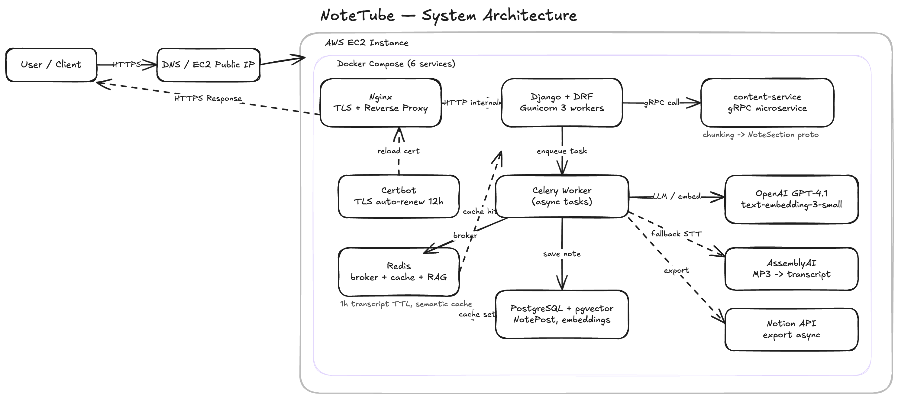

# NoteTube

[](https://github.com/JustinK33/NoteTube/actions/workflows/ci.yml)

<p align="center">
  
</p>

An AI-powered web app that turns YouTube videos and audio recordings into organized, structured notes — with semantic search, async processing, and Notion export.

---

## Tech Stack

- Python 3.12 / Django 6
- Celery + Redis (async task queue)
- gRPC microservice (content-service)
- OpenAI (GPT-4.1-nano + text-embedding-3-small)
- AssemblyAI (audio transcription)
- PostgreSQL + pgvector (vector search / RAG)
- LangChain (RAG pipeline)
- Nginx + Certbot (TLS auto-renewal)
- Docker Compose (6 services)
- AWS EC2
- Tailwind CSS

---

## Features

- **YouTube & MP3 → AI Notes** — paste a link or upload audio; notes are generated asynchronously in the background
- **Semantic search (RAG)** — ask questions against your notes using pgvector cosine similarity + GPT-4o-mini
- **Export** — download notes as TXT, Markdown, or PDF; push directly to a Notion page
- **Transcript caching** — Redis-backed (1h TTL) to avoid re-fetching the same video
- **Google OAuth** login alongside standard email/password auth
- **Rate limiting** — per-user Redis-backed limits on generation endpoints

---

## Architecture

```
Internet
   │ HTTPS
   ▼
nginx (alpine) — TLS termination, static files, Certbot auto-renew
   │ HTTP
   ▼
web (Django + Gunicorn)
   ├── celery-worker — async note generation, embeddings, Notion export
   └── content-service — gRPC transcript chunking & structured note pipeline
         │
         ├── Redis — broker, result backend, cache, RAG semantic cache
         └── PostgreSQL + pgvector — primary DB + vector store
```

---

## What I Learned From This Project

- **Async task queue (Celery + Redis)**
  Offloaded slow AI pipelines (30–150s) to background workers so users see a response in under a second and poll for results via `/api/task-status/`.

- **gRPC service-to-service communication**
  Connected the main Django backend to a dedicated content-service over gRPC + Protocol Buffers for fast, typed inter-process communication.

- **RAG semantic search with pgvector + LangChain**
  Embedded notes with `text-embedding-3-small`, stored vectors in pgvector, and wired a LangChain retrieval chain to answer natural-language questions over a user's note library.

- **Reverse proxy via Nginx**
  Nginx (alpine) sits in front of Gunicorn for TLS termination, static file serving, and connection handling — bypassing the Python process entirely for static assets.

- **TLS auto-renewal with Certbot**
  Certbot runs on a 12-hour cron inside Docker; nginx polls a sentinel file and reloads certificates without downtime.

- **Deployment on AWS EC2**
  Configured a single EC2 instance running all 6 Docker Compose services with external PostgreSQL (RDS/Neon) and Redis.

- **Continuous Integration with GitHub Actions**
  CI pipeline runs Black formatting checks and pytest with coverage on every push to main.

- **Multi-container orchestration with Docker Compose**
  Defined, networked, and managed 6 services (`web`, `celery-worker`, `content-service`, `redis`, `nginx`, `certbot`) with shared volumes and environment configuration.

---

## Running the Project

### With Docker (recommended)

```bash
git clone <repo>
cd NoteTube
cp .env.example .env   # fill in API keys
docker compose up --build
# App available at http://localhost:8000
```

### Locally (without Docker)

```bash
python3 -m venv venv
source venv/bin/activate
pip install -r requirements-dev.txt
python manage.py runserver
```

**Required environment variables:**

| Variable | Description |
|---|---|
| `SECRET_KEY` | Django secret key |
| `OPENAI_API_KEY` | OpenAI API key |
| `APIKEY` | AssemblyAI API key |
| `PGDATABASE / PGUSER / PGPASSWORD / PGHOST / PGPORT` | PostgreSQL connection |
| `REDIS_URL` | Redis URL |
| `GOOGLE_CLIENT_ID / GOOGLE_CLIENT_SECRET` | Google OAuth (optional) |
| `DEBUG` | `true` for local dev |
| `ALLOWED_HOSTS` | Comma-separated hostnames |
