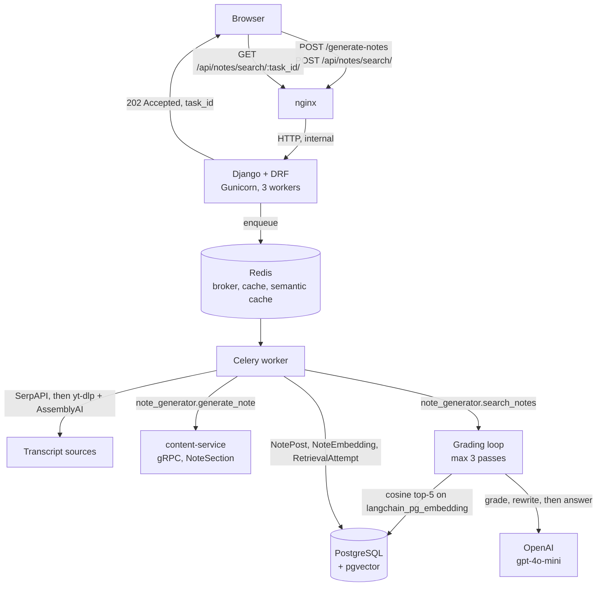

# NoteTube

[](https://github.com/JustinK33/NoteTube/actions/workflows/ci.yml)

A web app that turns YouTube videos and audio recordings into structured, searchable notes.

## What it does

The hard part of this project was never the note generation, it was getting a transcript at all.
YouTube blocks datacenter IPs, so the moment this moved from my laptop to an EC2 box the transcript fetch started returning 403s, 429s, and CAPTCHA pages.
Most of the interesting engineering here is the fallback chain and the async plumbing that grew out of that.

Paste a YouTube link or upload an MP3 and NoteTube transcribes it and generates structured notes in the background, so you get a response in under a second and poll for the result rather than watching a spinner for two minutes.
Once you have a library of notes, you can ask questions across all of them with semantic search, and export any note to TXT, Markdown, PDF, or straight into Notion.
Login is email/password or Google.

Transcript fetching tries SerpAPI's `youtube_transcript` engine first, falls back to downloading the audio with yt-dlp and transcribing it through AssemblyAI, and if both fail it returns a 502 with an error code the frontend translates into "upload the MP3 instead".
Successful transcripts cache in Redis for an hour and failures for ten minutes, so a blocked video doesn't cost a fresh round trip on every retry.

## Tech stack

| Layer | What it uses |
| --- | --- |
| Web | Django, Django REST Framework, django-allauth, Gunicorn, Tailwind CSS |
| Async | Celery with a Redis broker |
| Second service | gRPC and Protocol Buffers (`content-service`) |
| AI | OpenAI GPT-4.1-nano for note generation, GPT-4o-mini for questions, text-embedding-3-small for vectors, AssemblyAI for speech to text |
| Retrieval | LangChain, pgvector, PostgreSQL |
| Retrieval quality | LLM grades every retrieval, rewrites the query and retries up to twice, records the outcome for measurement |
| Transcripts | SerpAPI, yt-dlp, pytubefix |
| Export | reportlab for PDF, Notion API |
| Infra | Docker Compose, nginx, Certbot, AWS EC2, Vercel for the slim frontend |
| Checks | pytest, pytest-django, pytest-cov, Black |

## Architecture


```mermaid
flowchart TD
    B[Browser] -->|"POST /generate-notes<br>POST /api/notes/search/"| N[nginx]
    N -->|"HTTP, internal"| D["Django + DRF<br>Gunicorn, 3 workers"]
    D -->|"202 Accepted, task_id"| B
    B -->|"GET /api/notes/search/:task_id/"| N
    D -->|enqueue| R[("Redis<br>broker, cache, semantic cache")]
    R --> W[Celery worker]
    W -->|"SerpAPI, then yt-dlp + AssemblyAI"| T[Transcript sources]
    W -->|"note_generator.generate_note"| G["content-service<br>gRPC, NoteSection"]
    W -->|"note_generator.search_notes"| L["Grading loop<br>max 3 passes"]
    L -->|"cosine top-5 on langchain_pg_embedding"| P[("PostgreSQL<br>+ pgvector")]
    L -->|"grade, rewrite, then answer"| O["OpenAI<br>gpt-4o-mini"]
    W -->|"NotePost, NoteEmbedding, RetrievalAttempt"| P
```

Ask a question and Django validates it, hands it to Celery, and answers `202` with a task id in a few milliseconds while the browser starts polling.
The worker embeds the question, pulls the five nearest notes out of pgvector, and asks the model whether those notes can actually answer it; a verdict of `INSUFFICIENT` comes back with a rewritten query, the search runs again, and that repeats at most twice more.
Every question writes one `RetrievalAttempt` row with the grades, the rewrites, and the outcome, and if all three passes came back insufficient the answer is still generated but flagged `low_confidence` so the UI can say so rather than presenting a guess as fact.

Six Docker Compose services on one EC2 instance.
A request comes in over HTTPS, nginx terminates TLS and serves static files itself, and Django hands anything slow to Celery over Redis and returns a task id immediately.
The worker fetches the transcript, calls the `content-service` over gRPC to chunk it into `NoteSection` messages, sends those through OpenAI for the note text and again for embeddings, and writes the `NotePost` plus its vectors into Postgres.
Redis does triple duty as the Celery broker, the transcript cache, and the RAG semantic cache; Certbot renews the certificate on a 12 hour loop and reloads nginx without dropping connections.

## What building this taught me

**Your IP address is part of your architecture.** Everything worked locally and then broke on EC2, because YouTube blocks datacenter ranges. I spent a while treating this as a bug in my code before accepting it was a property of where the code ran. The fix wasn't one fix: a `TranscriptFetchError` hierarchy that carries an `error_code` and an `http_status`, a SerpAPI path that fetches transcripts from outside my IP, a yt-dlp plus AssemblyAI fallback that pays money instead of getting blocked, and a `diagnose_transcript` management command so I could tell which layer was failing in production without reading logs by hand.

**Caching the failures mattered more than caching the successes.** Successful transcripts cache for an hour, failed ones for ten minutes. Without the failure cache, a user hammering retry on a blocked video generated a fresh outbound request every time, which is the exact traffic pattern that gets you blocked harder.

**A 500 for "YouTube blocked us" teaches the user nothing.** The generate endpoint now returns 502 with a structured code, and the frontend turns that into a suggestion to upload the MP3. Same failure, but it's now an instruction instead of a dead end.

**I split the monolith for latency and got a typed contract as the better prize.** The `content-service` moved out to its own gRPC service so chunking wouldn't block a Gunicorn worker. What actually paid off was `proto/content_service.proto`: the boundary between Django and the chunker is a schema both sides compile against, so a shape change is a build error rather than a `KeyError` in a Celery task at 2am.

**Serverless size limits force an honest dependency audit.** Deploying the Django frontend to Vercel meant staying under the 500 MB function limit, which openai plus langchain plus celery plus reportlab blows through easily. `Backend/requirements.txt` is now the slim set that boots Django and serves pages, the heavy note-generation imports sit behind a `try/except ModuleNotFoundError` in `views.py`, and the frontend routes work on a host where the AI routes would not. Splitting them made me notice how much of the install had nothing to do with serving a page.

**A retrieval step with no verdict is a retrieval step with no feedback.** Search used to take whatever pgvector returned and answer from it, so a good answer and a confidently wrong one were indistinguishable from outside the process. Adding a grader that says `SUFFICIENT` or `INSUFFICIENT` and hands back a rewritten query was the small part. The larger part was noticing two things I had been wrong about: search was the last AI path still running inside the HTTP request, and `requirements.txt` pinned nothing, so CI was resolving a different LangChain on every run and a release could have broken `main` with no code change on my side. There is a `retrieval_stats` command and a `RetrievalAttempt` table because a claim about how much this helped is only worth making if I can recompute it from rows, and a grader's opinion of its own retrieval is not the same thing as a verified correct answer.

**Tests that touch Redis aren't tests of my code.** CI kept failing on a missing database and a missing cache connection until I added `testing_settings.py` with an in-memory SQLite database and Django's local-memory cache backend. The suite got faster and stopped depending on whether a service happened to be up.

## Documentation

- [PROJECT.md](PROJECT.md) is the long-form writeup: the full service diagram, the pipeline stage by stage, and the deployment layout.
- [proto/content_service.proto](proto/content_service.proto) is the gRPC contract between Django and the content-service.
- [.env.example](.env.example) lists every environment variable with a note on what it's for.
- `python manage.py retrieval_stats --days 30` reports how often retrieval was graded insufficient and whether a rewritten query recovered it, with raw counts next to every percentage.
- `python manage.py diagnose_transcript <url>` walks the transcript fallback chain one layer at a time and says which one failed.

## Quick start

```bash
git clone https://github.com/JustinK33/NoteTube.git
cd NoteTube
cp .env.example .env   # fill in the API keys
docker compose up --build
```

The app comes up on `http://localhost:8000`.

`.env.example` documents all of them, but the ones you cannot skip are `SECRET_KEY`, `OPENAI_API_KEY`, `APIKEY` for AssemblyAI, the `PG*` connection settings, and `REDIS_URL`.
`SERP_API`, the Google OAuth pair, and `YTDLP_COOKIES_FILE` are optional, and without `SERP_API` transcript fetching goes straight to the yt-dlp and AssemblyAI path.

Tests run against SQLite in memory, so they need no services up:

```bash
pip install -r requirements-dev.txt
pytest tests/ --cov=Backend/note_generator
```
