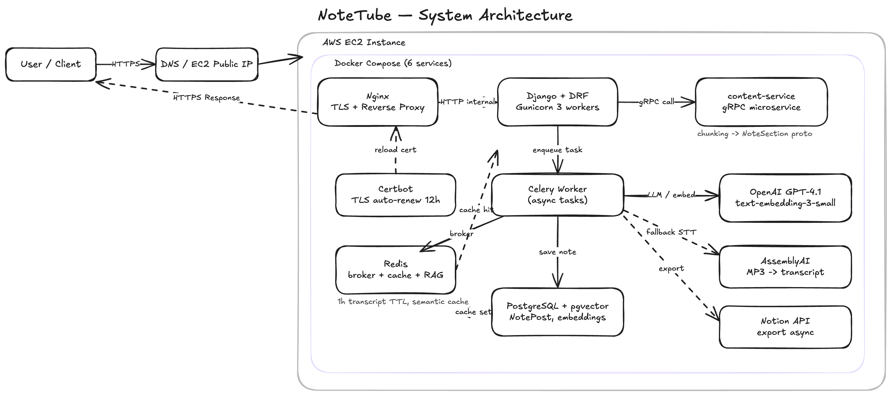

# NoteTube

[](https://github.com/JustinK33/NoteTube/actions/workflows/ci.yml)

An AI-powered web app that turns YouTube videos and audio recordings into organized, structured notes.

<p align="center">
  
</p>
<p align="center"><em>Request flow from nginx through Django, the Celery workers, and the gRPC content-service, down to Postgres/pgvector and Redis.</em></p>

## What It Does

Paste a YouTube link or upload an audio file, and NoteTube transcribes it and generates structured notes in the background so you're not stuck waiting on a spinner.
Once you have a library of notes, you can ask questions across all of them using semantic search, and export any note to TXT, Markdown, PDF, or straight to Notion.
It handles the whole pipeline - transcription, embeddings, retrieval, and export - behind a normal login (email/password or Google).

## Tech Stack

- Python / Django
- Celery / Redis
- gRPC (content-service)
- OpenAI (GPT-4.1-nano, text-embedding-3-small)
- AssemblyAI (transcription)
- PostgreSQL / pgvector
- LangChain
- Nginx / Certbot
- Docker Compose
- AWS EC2
- Tailwind CSS

## Install and Run

```bash
git clone <repo>
cd NoteTube
cp .env.example .env   # fill in API keys
docker compose up --build
```

App available at `http://localhost:8000`.

Required environment variables: `SECRET_KEY`, `OPENAI_API_KEY`, `APIKEY` (AssemblyAI), `PGDATABASE`/`PGUSER`/`PGPASSWORD`/`PGHOST`/`PGPORT`, `REDIS_URL`, `GOOGLE_CLIENT_ID`/`GOOGLE_CLIENT_SECRET` (optional), `DEBUG`, `ALLOWED_HOSTS`.

## What I Learned

- **Async task queue (Celery + Redis)** - offloaded slow AI pipelines (30-150s) to background workers so users see a response in under a second and poll for results.
- **gRPC service-to-service communication** - connected Django to a dedicated content-service over gRPC + Protocol Buffers for fast, typed inter-process communication.
- **RAG semantic search with pgvector + LangChain** - embedded notes with `text-embedding-3-small` and wired a LangChain retrieval chain to answer questions over a user's note library.
- **Reverse proxy via Nginx** - TLS termination and static file serving in front of Gunicorn, bypassing the Python process for static assets.
- **TLS auto-renewal with Certbot** - runs on a 12-hour cron inside Docker; nginx reloads certificates without downtime.
- **Deployment on AWS EC2** - a single instance running all 6 Docker Compose services with external Postgres and Redis.
- **CI with GitHub Actions** - Black formatting checks and pytest with coverage on every push to main.
